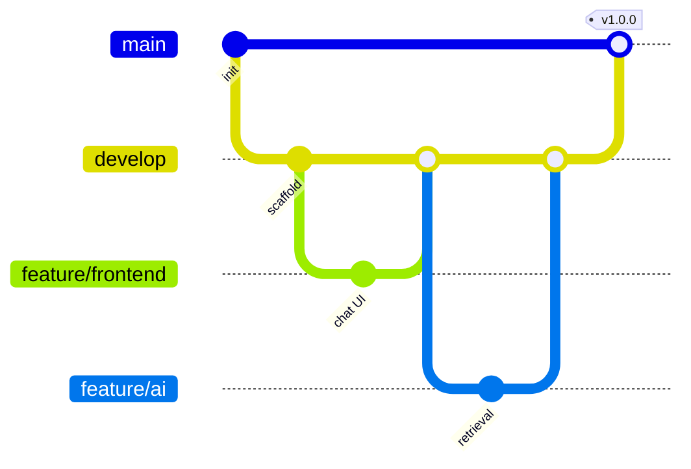

# Contributing to DocuMind

DocuMind is a two-person build with a clean ownership split. These conventions keep the two halves moving in parallel with near-zero merge conflicts.

| Developer | Owns |
|-----------|------|
| **Developer 1 — Full Stack (MERN)** | `frontend/`, `backend/`, `shared/` (client side of the contract) |
| **Developer 2 — GenAI (FastAPI)** | `ai-service/`, `shared/` (AI side of the contract) |

Because each developer owns distinct top-level directories, day-to-day work rarely touches the same files. The only shared surface is `shared/` — changes there must be agreed on in a PR.

---

## Branch strategy

We use a **Git Flow** style model.



| Branch | Purpose | Merges into |
|--------|---------|-------------|
| `main` | Production-ready, tagged releases only. Protected. | — |
| `develop` | Integration branch; always deployable to staging. | `main` |
| `feature/frontend` | Frontend feature work. | `develop` |
| `feature/backend` | Backend feature work. | `develop` |
| `feature/ai` | AI service feature work. | `develop` |
| `release/x.y.z` | Release stabilization (version bump, final fixes). | `main` + `develop` |
| `hotfix/x.y.z` | Urgent production fix. | `main` + `develop` |

**Rules**
- Never commit directly to `main` or `develop`.
- Branch feature work from `develop`; keep branches short-lived.
- For granular work, branch further: `feature/frontend/chat-ui`, `feature/ai/chunking`.

---

## Commit naming convention

We follow **[Conventional Commits](https://www.conventionalcommits.org/)**:

```
<type>(<scope>): <short imperative summary>
```

**Types:** `feat` · `fix` · `docs` · `style` · `refactor` · `perf` · `test` · `chore` · `ci`

**Scopes:** `frontend` · `backend` · `ai` · `shared` · `docs` · `deploy`

**Examples**
```
feat(frontend): add citation chips to chat messages
fix(backend): reject uploads over the size limit with 422
feat(ai): add relevance threshold for "I don't know" refusal
docs(shared): version the /chat contract to v1
chore(deploy): add render.yaml for the backend service
```

Keep the summary under ~72 chars, imperative mood ("add", not "added").

---

## Pull request workflow

1. **Branch** from `develop` using the naming convention.
2. **Commit** using Conventional Commits.
3. **Push** and open a PR **into `develop`** (not `main`).
4. **Fill in the PR template** — what changed, why, how to test, screenshots for UI.
5. **Self-review** the diff; ensure no secrets, no stray `console.log`/`print`.
6. **Request review** from the other developer if the change touches `shared/` or the integration boundary.
7. **CI must pass** (lint/test/build once configured).
8. **Squash-merge** into `develop`. Delete the branch.
9. Release: `develop → release/x.y.z → main`, tagged `vX.Y.Z`.

**PR checklist**
- [ ] Branch targets `develop`.
- [ ] Commits follow Conventional Commits.
- [ ] No secrets or `.env` files committed.
- [ ] Contract changes in `shared/` are agreed with the other developer.
- [ ] Docs updated if behavior or API changed.
- [ ] UI changes include screenshots.

---

## Local setup

See the [Quick Start](./README.md#quick-start) in the README for per-service run instructions.

## Code style

- **Frontend/Backend (JS):** ESLint + Prettier. 2-space indent.
- **AI service (Python):** Black + Ruff. Type hints on public functions.
- Keep controllers/routers thin; put logic in services/pipelines.
