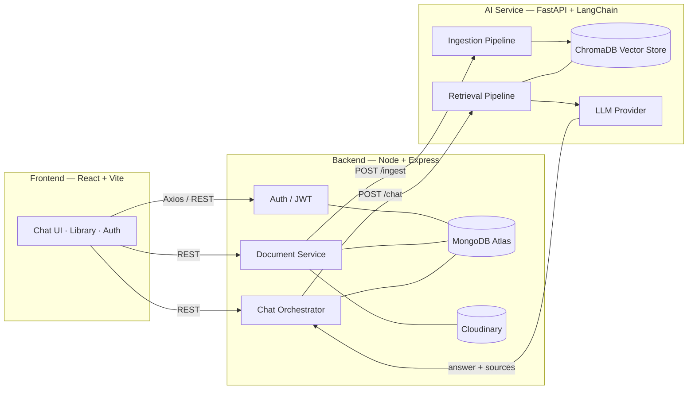
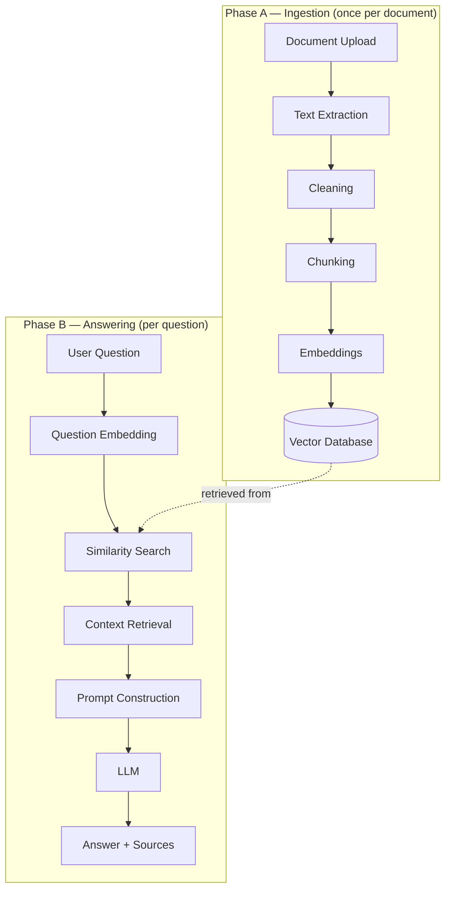

<div align="center">

# DocuMind

### An AI-powered document intelligence platform — upload your documents, chat with them, and get answers backed by citations.

*A private, hallucination-free knowledge assistant built on Retrieval-Augmented Generation (RAG).*

<br/>

[](./LICENSE)
[](#tech-stack)
[](#tech-stack)
[](#tech-stack)
[](#tech-stack)
[](./CONTRIBUTING.md)

[Features](#features) &nbsp;•&nbsp; [Architecture](#architecture) &nbsp;•&nbsp; [Quick Start](#quick-start) &nbsp;•&nbsp; [API](#api-overview) &nbsp;•&nbsp; [Roadmap](#roadmap) &nbsp;•&nbsp; [Contributing](./CONTRIBUTING.md)

</div>

---

## Overview

**DocuMind** is a full-stack, AI-native knowledge assistant. A user uploads their own documents (PDFs, notes, reports) and then asks questions in plain language — getting back answers that are **grounded strictly in those documents**, with **citations** pointing to exactly where each answer came from.

Think of it as a private ChatGPT that only knows what you fed it — and never makes things up, because every answer is traceable to a source page.

> **The core promise:** DocuMind never hallucinates. If the answer isn't in your documents, it says so.

### Why this exists

Large language models are powerful but unreliable when asked about *your* private data — they either don't know it or invent plausible-sounding falsehoods. DocuMind solves this with the **Retrieval-Augmented Generation (RAG)** pattern: it retrieves the most relevant passages from your documents first, then constrains the model to answer *only* from that retrieved context, and returns the source passages alongside every answer so you can verify them.

---

## Features

| Feature | Description |
|---------|-------------|
| **Secure Auth** | JWT-based signup/login with protected routes and hashed credentials. |
| **Document Upload** | Upload PDFs; raw files stored in Cloudinary, metadata in MongoDB. |
| **Document Library** | View all uploads with live processing status (`uploaded → processing → ready`). |
| **Grounded Chat** | Ask natural-language questions and get answers backed by your documents. |
| **Citations** | Every answer includes clickable source references (`contract.pdf, page 3`). |
| **No Hallucinations** | The model answers *only* from retrieved context, or admits it doesn't know. |
| **Conversation History** | Resume past conversations; full message threads persisted. |
| **Multi-Document Search** | Query across one, several, or your entire library at once. |
| **Streaming Answers** *(roadmap)* | Token-by-token responses like ChatGPT. |

---

## Architecture

DocuMind is a **monorepo** with three independently deployable services connected by a single, clean API contract. This clean split lets the **MERN developer** and the **GenAI developer** build in parallel with near-zero merge conflicts.



> Full system design, sequence diagrams, and data flow live in **[docs/ARCHITECTURE.md](./docs/ARCHITECTURE.md)**.

### The one interface between the two developers

Both halves talk through **two endpoints** on the AI service. Agree on this shape and you can build in parallel:

```http
POST /ingest   { documentId, fileUrl }            -> { status: "processing" }
POST /chat     { userId, question, documentIds }  -> { answer, sources[] }
```

The MERN developer can build the entire UI against a stubbed response while the GenAI developer builds the real pipeline — they integrate only at the end.

---

## Folder Structure

```
documind/
├── frontend/                 # React (Vite) SPA — the user-facing application
│   ├── public/
│   └── src/
│       ├── assets/           # Static images, fonts, logos
│       ├── components/       # Reusable presentational components
│       ├── layouts/          # Page shells (AuthLayout, AppLayout)
│       ├── pages/            # Route-level screens (Login, Library, Chat)
│       ├── hooks/            # Custom React hooks (useAuth, useChat)
│       ├── services/         # Axios API clients (authApi, docApi, chatApi)
│       ├── context/          # React Context providers (AuthContext)
│       ├── utils/            # Pure helpers (formatters, guards)
│       ├── styles/           # Tailwind config, global CSS
│       ├── router/           # React Router route definitions
│       ├── config/           # Env-driven runtime config
│       ├── constants/        # Enums, status labels, route names
│       ├── lib/              # Third-party wrappers (axios instance)
│       └── icons/            # SVG icon components
│
├── backend/                  # Node.js + Express REST API — the application shell
│   ├── src/
│   │   ├── config/           # DB, Cloudinary, env, logger setup
│   │   ├── controllers/      # Request handlers (thin)
│   │   ├── routes/           # Express route definitions
│   │   ├── middleware/       # Auth, error, upload, validation middleware
│   │   ├── models/           # Mongoose schemas (User, Document, ...)
│   │   ├── services/         # Business logic (thick)
│   │   ├── repositories/     # Data-access layer over Mongoose
│   │   ├── validators/       # Request-body schema validation
│   │   ├── utils/            # Generic helpers (jwt, hashing)
│   │   ├── helpers/          # Domain helpers (response formatters)
│   │   ├── uploads/          # Temp local upload staging (gitignored)
│   │   ├── jobs/             # Background jobs / queue workers
│   │   └── socket/           # WebSocket handlers (status, streaming)
│   └── tests/
│
├── ai-service/               # Python + FastAPI — the RAG intelligence layer
│   ├── app/
│   │   ├── api/              # FastAPI routers (/ingest, /chat, /health)
│   │   ├── core/            # Settings, logging, dependency wiring
│   │   ├── models/          # Internal domain models
│   │   ├── schemas/         # Pydantic request/response schemas
│   │   ├── ingestion/       # Extract -> clean -> chunk orchestration
│   │   ├── retrieval/       # Similarity search + context assembly
│   │   ├── embeddings/      # Embedding provider abstraction
│   │   ├── vectorstore/     # ChromaDB adapter (swappable)
│   │   ├── prompts/         # Prompt templates (grounding, refusal)
│   │   ├── llm/             # LLM provider abstraction (OpenAI/Gemini)
│   │   ├── parsers/         # PDF/text extractors (PyMuPDF, pdfplumber)
│   │   ├── pipelines/       # High-level ingest & answer pipelines
│   │   └── utils/           # Token counting, text helpers
│   └── tests/
│
├── shared/                   # Cross-service source of truth
│   ├── api-contracts/        # OpenAPI specs + endpoint contracts
│   ├── constants/            # Shared enums (statuses, error codes)
│   └── schemas/              # Shared JSON schemas (chat, ingest payloads)
│
├── docs/                     # Architecture, API, DB, RAG, roadmap docs
│   ├── diagrams/
│   └── screenshots/
│
├── .github/                  # PR/issue templates, CI workflows
├── docker-compose.yml        # Local multi-service orchestration (future)
├── .gitignore
├── LICENSE
└── README.md
```

> Detailed per-folder responsibilities are documented in each service's local `README.md`.

---

## Tech Stack

<table>
<tr>
<td valign="top" width="33%">

**Frontend**
- React 18 (Vite)
- JavaScript (ES2022)
- Tailwind CSS
- React Router
- Axios

</td>
<td valign="top" width="33%">

**Backend**
- Node.js + Express.js
- JavaScript
- MongoDB Atlas + Mongoose
- JWT Authentication
- Multer (uploads)
- Cloudinary (file store)

</td>
<td valign="top" width="33%">

**AI Service**
- Python 3.11 + FastAPI
- LangChain
- ChromaDB (vector store)
- OpenAI / Gemini embeddings + LLM
- PyMuPDF / pdfplumber
- Sentence Transformers *(optional)*

</td>
</tr>
</table>

**Deployment:** Vercel (frontend) · Render (backend + AI service) · Docker & GitHub Actions *(future)*

---

## Quick Start

### Prerequisites

- **Node.js** >= 18 and **npm**
- **Python** >= 3.11 and **pip**
- A **MongoDB Atlas** connection string
- A **Cloudinary** account (cloud name, API key, secret)
- An **OpenAI** or **Gemini** API key

### 1. Clone

```bash
git clone https://github.com/<your-org>/documind.git
cd documind
```

### 2. Configure environment

Copy each service's example env file and fill in your keys (see [Environment Variables](#environment-variables)):

```bash
cp backend/.env.example      backend/.env
cp frontend/.env.example     frontend/.env
cp ai-service/.env.example   ai-service/.env
```

### 3. Run each service

<details>
<summary><b>Frontend (React + Vite)</b></summary>

```bash
cd frontend
npm install
npm run dev          # http://localhost:5173
```
</details>

<details>
<summary><b>Backend (Express API)</b></summary>

```bash
cd backend
npm install
npm run dev          # http://localhost:5000
```
</details>

<details>
<summary><b>AI Service (FastAPI)</b></summary>

```bash
cd ai-service
python -m venv .venv
source .venv/bin/activate        # Windows: .venv\Scripts\activate
pip install -r requirements.txt
uvicorn app.main:app --reload --port 8000     # http://localhost:8000
```
</details>

### 4. (Future) One command

```bash
docker compose up --build
```

---

## Environment Variables

### `backend/.env`

| Variable | Description |
|----------|-------------|
| `PORT` | Express server port (default `5000`) |
| `MONGODB_URI` | MongoDB Atlas connection string |
| `JWT_SECRET` | Secret for signing JWTs |
| `JWT_EXPIRES_IN` | Token lifetime (e.g. `7d`) |
| `CLOUDINARY_CLOUD_NAME` | Cloudinary cloud name |
| `CLOUDINARY_API_KEY` | Cloudinary API key |
| `CLOUDINARY_API_SECRET` | Cloudinary API secret |
| `AI_SERVICE_URL` | Base URL of the FastAPI service |
| `CLIENT_URL` | Frontend origin for CORS |

### `frontend/.env`

| Variable | Description |
|----------|-------------|
| `VITE_API_BASE_URL` | Base URL of the Express backend |

### `ai-service/.env`

| Variable | Description |
|----------|-------------|
| `LLM_PROVIDER` | `openai` or `gemini` |
| `OPENAI_API_KEY` | OpenAI key (if using OpenAI) |
| `GEMINI_API_KEY` | Gemini key (if using Gemini) |
| `EMBEDDING_MODEL` | Embedding model identifier |
| `CHROMA_PERSIST_DIR` | Local path for ChromaDB persistence |
| `CHUNK_SIZE` / `CHUNK_OVERLAP` | Chunking parameters |
| `TOP_K` | Number of chunks to retrieve per query |

> A complete `.env.example` ships in each service directory. **Never commit real secrets.**

---

## API Overview

The system exposes three surfaces. Full request/response schemas and status codes are in **[docs/API.md](./docs/API.md)**.

### Backend (client-facing)

| Method | Endpoint | Purpose |
|--------|----------|---------|
| `POST` | `/api/auth/signup` | Register a new user |
| `POST` | `/api/auth/login` | Authenticate, receive JWT |
| `GET`  | `/api/profile` | Get current user profile |
| `POST` | `/api/documents/upload` | Upload a PDF |
| `GET`  | `/api/documents` | List the user's documents |
| `DELETE` | `/api/documents/:id` | Delete a document |
| `GET`  | `/api/documents/:id/status` | Poll processing status |
| `GET`  | `/api/conversations` | List conversations |
| `GET`  | `/api/conversations/:id` | Get one conversation with messages |
| `DELETE` | `/api/conversations/:id` | Delete a conversation |
| `POST` | `/api/chat` | Ask a question, get a grounded answer |

### AI Service (internal, called by backend)

| Method | Endpoint | Purpose |
|--------|----------|---------|
| `POST` | `/ingest` | Extract, chunk, embed & store a document |
| `POST` | `/chat` | Retrieve context & generate a grounded answer |
| `GET`  | `/health` | Liveness probe |

---

## RAG Pipeline

DocuMind's intelligence layer runs in two phases — **ingestion** (once per document) and **answering** (once per question).



> Deep dive — chunking strategy, grounding prompts, and the "I don't know" guardrail — in **[docs/RAG_PIPELINE.md](./docs/RAG_PIPELINE.md)**.

---

## Screenshots

> _Placeholders — replace with real captures once the UI is built._

| Login | Document Library | Chat with Citations |
|-------|------------------|---------------------|
|  |  |  |

---

## Roadmap

DocuMind is built in **six phases** — ship a thin end-to-end version first, then deepen each layer. See the full breakdown with per-phase tasks in **[docs/ROADMAP.md](./docs/ROADMAP.md)**.

- [x] **Phase 1 — Repository Setup** · monorepo scaffold, contracts, tooling
- [ ] **Phase 2 — Frontend** · auth screens, upload, library, chat UI (stubbed)
- [ ] **Phase 3 — Backend** · auth, uploads, Mongo models, orchestration
- [ ] **Phase 4 — AI Service** · real ingestion + retrieval + grounded answers
- [ ] **Phase 5 — Integration** · end-to-end wiring, citations, history
- [ ] **Phase 6 — Deployment** · Vercel + Render, Docker, CI/CD

### Future scope

- Streaming answers (token-by-token)
- Follow-up questions with conversation memory
- Multi-format uploads (Word, HTML, plain text)
- Library-wide search across all documents
- Full Docker Compose + GitHub Actions CI/CD

---

## Contributors

DocuMind is a two-person build with a clean ownership split:

| Role | Owns |
|------|------|
| **Developer 1 — Full Stack (MERN)** | `frontend/` · `backend/` — auth, uploads, storage, chat UI, orchestration |
| **Developer 2 — GenAI (FastAPI)** | `ai-service/` — ingestion, retrieval, embeddings, grounded generation |

> See **[CONTRIBUTING.md](./CONTRIBUTING.md)** for branch strategy, commit conventions, and the PR workflow.

---

## License

Distributed under the **MIT License**. See [`LICENSE`](./LICENSE) for details.

---

## Acknowledgements

- [LangChain](https://www.langchain.com/) — RAG orchestration
- [ChromaDB](https://www.trychroma.com/) — local-first vector store
- [OpenAI](https://openai.com/) & [Google Gemini](https://ai.google.dev/) — embeddings & generation
- [PyMuPDF](https://pymupdf.readthedocs.io/) & [pdfplumber](https://github.com/jsvine/pdfplumber) — PDF text extraction
- [MongoDB Atlas](https://www.mongodb.com/atlas), [Cloudinary](https://cloudinary.com/), [Vercel](https://vercel.com/), [Render](https://render.com/)

<div align="center">
<br/>
<sub>Built as a portfolio-grade full-stack and AI engineering project.</sub>
</div>
