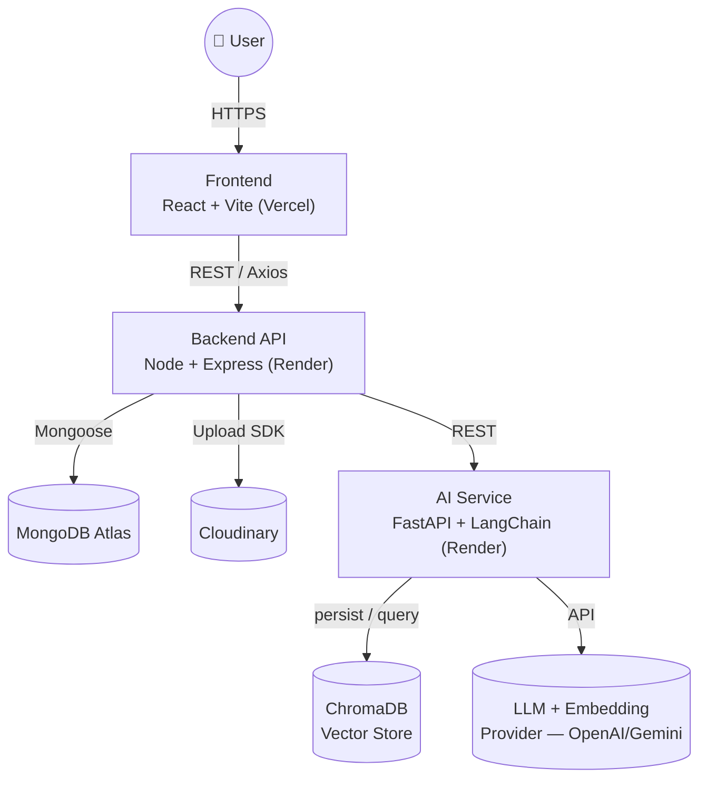
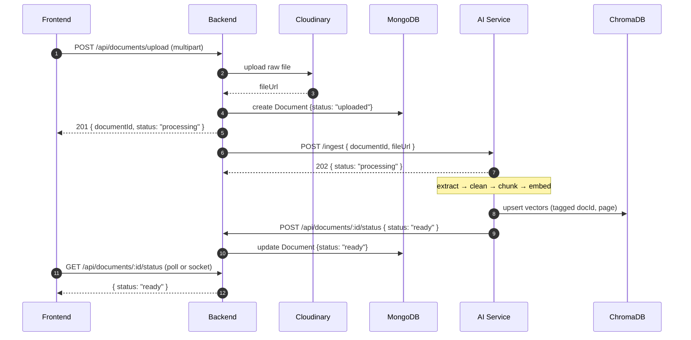
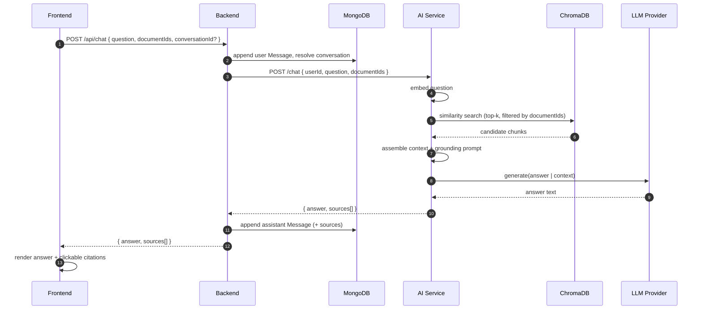
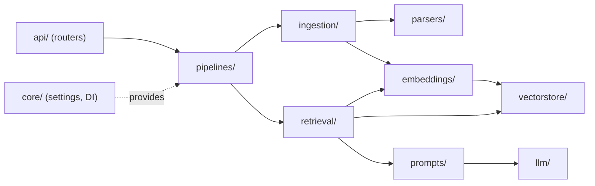
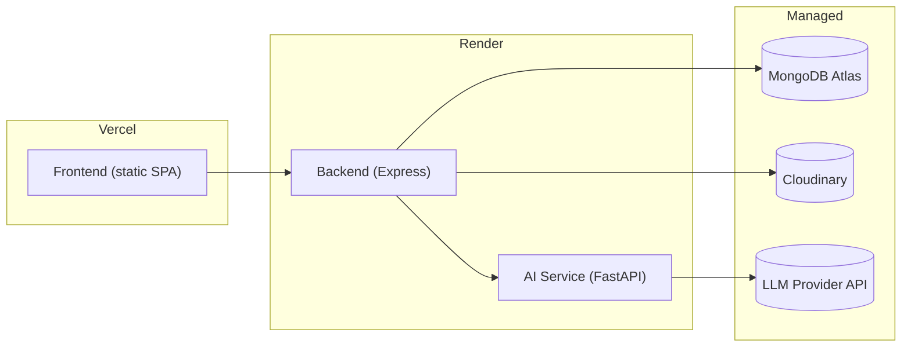

# 🏗️ Architecture — DocuMind

This document describes DocuMind's system design, service boundaries, data flow, and the reasoning behind the key decisions.

---

## 1. Design goals

| Goal | How it's achieved |
|------|-------------------|
| **Zero hallucination** | The LLM answers *only* from retrieved chunks; a grounding prompt + refusal guardrail forbids outside knowledge. |
| **Parallel development** | Three isolated services connected by one versioned API contract in `shared/`. |
| **Provider independence** | LLM, embeddings, and vector store sit behind swappable adapters. |
| **Traceability** | Every answer carries the source chunks (document + page) it was built from. |
| **Scalability** | Layered backend (controller → service → repository) and a stateless AI service that scales horizontally. |

---

## 2. System context (C4 — Level 1)



### Responsibilities

- **Frontend** — the entire user experience: auth screens, upload, document library with live status, chat interface, citation rendering, conversation history. Holds no business logic beyond presentation and API calls.
- **Backend** — the *application shell*: authentication, file intake & storage, the MongoDB data model, and orchestration. It is the **only** service the frontend talks to and the **only** caller of the AI service.
- **AI Service** — the *intelligence layer*: turns raw documents into grounded answers via the RAG pipeline. Completely stateless per request except for the vector store.

> **Key rule:** the frontend never calls the AI service directly. The backend is the single gateway — it owns auth, rate limiting, and persistence around every AI call.

---

## 3. Ingestion sequence

When a user uploads a document, the backend stores it and hands off to the AI service asynchronously.



The frontend reflects `uploaded → processing → ready` (or `failed`) either by polling `/status` or via a WebSocket push from `backend/src/socket/`.

---

## 4. Chat / answering sequence



---

## 5. Backend layering

The Express backend uses a **strict layered architecture** so responsibilities never bleed across boundaries:

```
Route  →  Middleware  →  Controller  →  Service  →  Repository  →  Model (Mongoose)
                                           │
                                           └──→ AI Service client (services/aiService.js)
```

| Layer | Responsibility | Must NOT |
|-------|----------------|----------|
| **Routes** | Map HTTP verbs/paths to controllers | contain logic |
| **Middleware** | Auth, validation, upload, error handling | contain business rules |
| **Controllers** | Parse request, call service, shape response | touch the DB directly |
| **Services** | Business logic, orchestration, external calls | know about `req`/`res` |
| **Repositories** | All Mongoose queries | contain business rules |
| **Models** | Schema definitions | contain orchestration |

This keeps controllers thin and testable, and isolates every database access into repositories.

---

## 6. AI service internals



Every external dependency (LLM, embeddings, vector store, parser) is accessed through a thin abstraction so the concrete provider can be swapped via config — e.g. ChromaDB → Qdrant, or OpenAI → Gemini — without touching pipeline logic.

---

## 7. The shared contract

`shared/` is the **single source of truth** that binds the three services:

- `shared/api-contracts/` — OpenAPI specs + human-readable endpoint contracts.
- `shared/constants/` — canonical enums: processing statuses, error codes, roles.
- `shared/schemas/` — JSON schemas for the `/ingest` and `/chat` payloads.

Because the contract is versioned and shared, the MERN developer can build the whole UI against a stub while the GenAI developer builds the real pipeline. They integrate only at the end — with confidence the shapes match.

---

## 8. Deployment topology



**Future:** `docker-compose.yml` orchestrates all three locally; GitHub Actions runs lint/test/build on every PR and deploys on merge to `main`.

---

## 9. Cross-cutting concerns

| Concern | Approach |
|---------|----------|
| **Auth** | JWT issued by backend; verified in Express middleware. AI service trusts backend only (internal network / shared secret). |
| **Errors** | Central error middleware (backend) + structured error responses shaped by `shared/constants/error-codes`. |
| **Logging** | Structured logs per service; correlation via `documentId` / `conversationId`. |
| **Config** | 12-factor — all secrets via env vars; nothing hard-coded. |
| **CORS** | Backend allows only `CLIENT_URL`. |
| **Validation** | Request bodies validated at the edge (backend validators, Pydantic schemas in AI service). |
