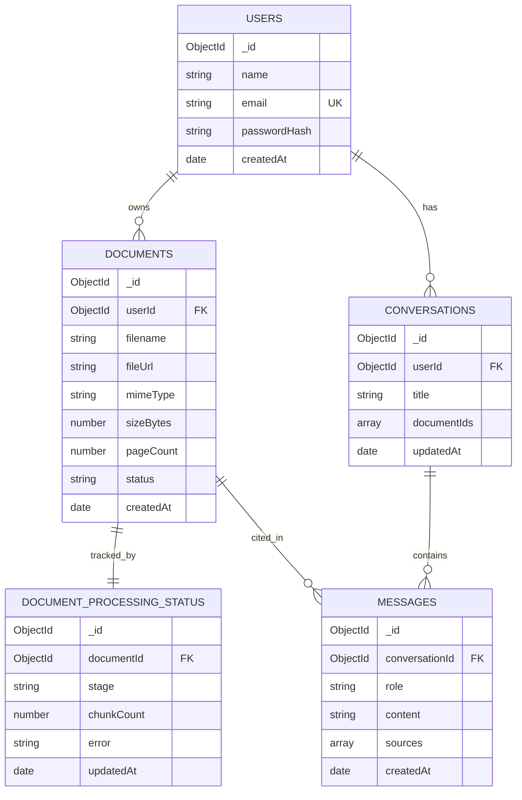

# 🗄️ Database Design — DocuMind

DocuMind uses **MongoDB Atlas** (via Mongoose). Document embeddings live separately in **ChromaDB** — MongoDB stores metadata and application state, the vector store stores meaning.

---

## Collections overview



---

## 1. `users`

Stores account and authentication data.

| Field | Type | Notes |
|-------|------|-------|
| `_id` | ObjectId | Primary key |
| `name` | String | Display name |
| `email` | String | **Unique**, indexed, lowercased |
| `passwordHash` | String | bcrypt hash — never the raw password |
| `createdAt` / `updatedAt` | Date | Timestamps |

**Why:** the identity anchor. Every document and conversation is scoped to a `userId` so users only ever see their own data.

---

## 2. `documents`

One record per uploaded file. The raw file lives in Cloudinary; this is its metadata.

| Field | Type | Notes |
|-------|------|-------|
| `_id` | ObjectId | Primary key — the `documentId` used across services |
| `userId` | ObjectId → `users` | Owner (indexed) |
| `filename` | String | Original filename |
| `fileUrl` | String | Cloudinary URL passed to `/ingest` |
| `mimeType` | String | e.g. `application/pdf` |
| `sizeBytes` | Number | File size |
| `pageCount` | Number | Filled after extraction |
| `status` | String (enum) | `uploaded · processing · ready · failed` |
| `createdAt` / `updatedAt` | Date | Timestamps |

**Why:** the library view and the "is it ready yet?" state both read from here. `status` is the single field the UI polls.

---

## 3. `document_processing_status`

A dedicated collection for the *detail* of ingestion progress — kept separate from `documents` so verbose pipeline telemetry doesn't bloat the record the UI lists.

| Field | Type | Notes |
|-------|------|-------|
| `_id` | ObjectId | Primary key |
| `documentId` | ObjectId → `documents` | Indexed, unique |
| `stage` | String (enum) | `extracting · cleaning · chunking · embedding · storing · done · failed` |
| `chunkCount` | Number | Chunks produced |
| `error` | String \| null | Failure reason, if any |
| `updatedAt` | Date | Last progress update |

**Why:** enables a granular progress indicator and clean failure diagnostics without touching the main `documents` record on every step.

---

## 4. `conversations`

A chat thread. Groups messages and remembers which documents are in scope.

| Field | Type | Notes |
|-------|------|-------|
| `_id` | ObjectId | Primary key |
| `userId` | ObjectId → `users` | Owner (indexed) |
| `title` | String | Auto-generated from first question |
| `documentIds` | [ObjectId] | Documents this conversation searches |
| `createdAt` / `updatedAt` | Date | `updatedAt` drives recent-first ordering |

**Why:** lets a user resume past conversations and constrains retrieval to the relevant documents.

---

## 5. `messages`

Individual turns in a conversation. Sources are embedded so citations survive even if a document is later deleted.

| Field | Type | Notes |
|-------|------|-------|
| `_id` | ObjectId | Primary key |
| `conversationId` | ObjectId → `conversations` | Indexed |
| `role` | String (enum) | `user · assistant` |
| `content` | String | The message text |
| `sources` | [Source] | Only on `assistant` messages |
| `createdAt` | Date | Ordering within a thread |

**Embedded `Source` shape:**

```json
{ "documentId": "abc123", "page": 3, "snippet": "The penalty clause states..." }
```

**Why:** this is what powers grounded answers with clickable citations. Storing `sources` inline means the chat history is fully self-describing.

---

## Indexing strategy

| Collection | Index | Purpose |
|------------|-------|---------|
| `users` | `{ email: 1 }` unique | Login lookup |
| `documents` | `{ userId: 1, createdAt: -1 }` | Library listing |
| `document_processing_status` | `{ documentId: 1 }` unique | Status lookup |
| `conversations` | `{ userId: 1, updatedAt: -1 }` | Recent conversations |
| `messages` | `{ conversationId: 1, createdAt: 1 }` | Thread rendering |

---

## Relationship to the vector store

MongoDB **does not** store embeddings. During ingestion, each chunk's vector is written to **ChromaDB** tagged with `documentId` and `page`. At query time the AI service filters the vector search by the conversation's `documentIds`, then returns matching chunks as `sources`. MongoDB and ChromaDB are joined only by the shared `documentId`.
