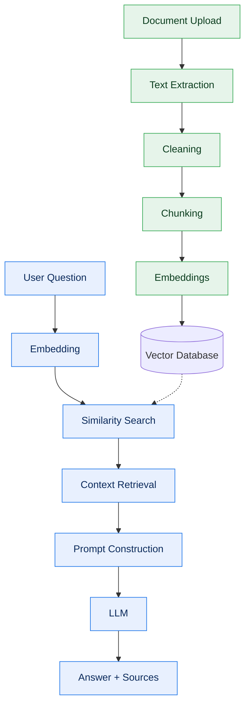
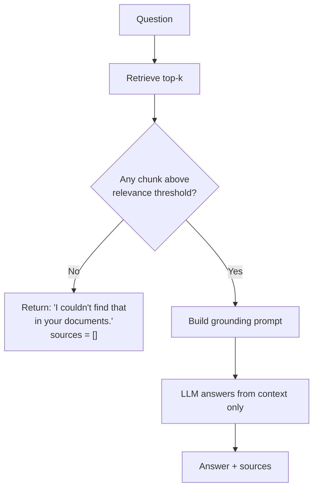

# RAG Pipeline — DocuMind

The intelligence layer implements **Retrieval-Augmented Generation (RAG)**. The goal is not "call the LLM" — it is retrieving the *right* context and forcing the model to stay grounded in it, so DocuMind never hallucinates.

The pipeline has two phases: **ingestion** (once per document) and **answering** (once per question).

---

## Full pipeline



---

## Phase A — Ingestion

Runs once when a document is uploaded. Owned by `ai-service/app/ingestion/` and `pipelines/`.

### 1. Text extraction — `parsers/`
Extract raw text page-by-page using **PyMuPDF** (fast, layout-aware) with **pdfplumber** as a fallback for tricky tables. Page numbers are preserved from the start so every downstream chunk can be traced to a page for citations.

### 2. Cleaning
Normalize whitespace, strip repeated headers/footers, fix hyphenation across line breaks, and drop non-content noise. Clean text produces cleaner embeddings and better retrieval.

### 3. Chunking — `ingestion/`
Split text into overlapping chunks so context isn't cut mid-thought.

| Parameter | Default | Rationale |
|-----------|---------|-----------|
| `CHUNK_SIZE` | ~800 tokens | Large enough for a coherent idea, small enough for precise retrieval. |
| `CHUNK_OVERLAP` | ~120 tokens | Preserves context that straddles a chunk boundary. |
| Strategy | recursive, structure-aware | Prefer splitting on paragraph/sentence boundaries over hard cuts. |

Each chunk carries metadata: `{ documentId, page, chunkIndex }`.

### 4. Embeddings — `embeddings/`
Convert each chunk into a vector using the configured embedding model (OpenAI or Gemini), behind a swappable provider interface.

### 5. Vector storage — `vectorstore/`
Upsert vectors into **ChromaDB**, tagged with the chunk metadata. This is what makes retrieval filterable by document and traceable to a page.

---

## Phase B — Answering

Runs on every question. Owned by `ai-service/app/retrieval/`, `prompts/`, and `llm/`.

### 1. Question embedding
Embed the user's question with the **same** model used for chunks — retrieval only works if both live in the same vector space.

### 2. Similarity search — `retrieval/`
Query ChromaDB for the top-k most similar chunks, **filtered** to the conversation's `documentIds`. Default `TOP_K = 4–6`.

### 3. Context retrieval
Assemble the retrieved chunks into a context block, de-duplicated and ordered, staying within the model's context budget. Each chunk keeps its `{ documentId, page }` tag.

### 4. Prompt construction — `prompts/`
Build a **grounding prompt** that:
- Injects the retrieved context.
- Instructs the model to answer **only** from that context.
- Forbids using outside/general knowledge.
- Requires citing the supporting source(s).

Sketch of the grounding template:

```
You are DocuMind. Answer the question using ONLY the context below.
If the answer is not in the context, say you don't know — do not guess.
Cite the source page(s) you used.

Context:
{retrieved_chunks_with_page_tags}

Question: {question}
```

### 5. Generation — `llm/`
Send the prompt to the configured LLM (OpenAI or Gemini), behind a swappable provider interface.

### 6. Answer + sources
Return the answer alongside the `sources` (documentId, page, snippet) it was built from. The backend persists this and the frontend renders clickable citations.

---

## The anti-hallucination guardrails

DocuMind's central promise is enforced by **three** independent mechanisms:

1. **Context-only prompting** — the model is explicitly constrained to the retrieved context and forbidden from using outside knowledge.
2. **The "I don't know" path** — if similarity scores fall below a relevance threshold, the pipeline short-circuits and returns an honest refusal with empty `sources` instead of calling the LLM to invent an answer.
3. **Source-backed responses** — every non-refusal answer must be accompanied by the source chunks it drew from, making claims verifiable by the user.



---

## Provider independence

Everything provider-specific is isolated behind an interface so nobody is locked in:

| Concern | Abstraction | Swap example |
|---------|-------------|--------------|
| Embeddings | `embeddings/` | OpenAI ↔ Gemini ↔ Sentence Transformers |
| Generation | `llm/` | OpenAI ↔ Gemini |
| Vector store | `vectorstore/` | ChromaDB ↔ Pinecone ↔ Qdrant |
| Parsing | `parsers/` | PyMuPDF ↔ pdfplumber |

Configuration (`core/settings`) selects the concrete implementation at runtime — pipeline code never changes.
